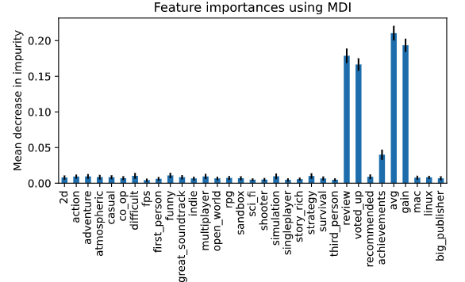
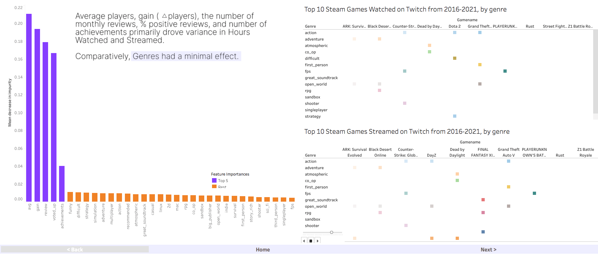
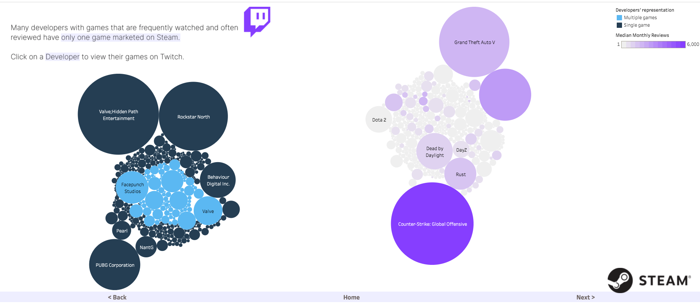

# gaming_stats_analysis

## Project Overview
**Selected Topic**: 

Twitch viewership analysis based on game genre(s)/year/hours streamed

**Reasoning on Choosing the Topic**:

The gaming industry has been growing with a rapid increase in audience size. Live streaming, among all the other entertainment forms of activities, is incredibly popular and is a growing industry. As of May 2021, there were 9,023,142 streamers on Twitch.tv with an average of 110,367 live channels at a time. Twitch GVC revenue generated was 1.6 USD billions in year 2018, 1.5 USD billions in 2019, and 2 USD billions in 2020, which has surpassed YouTube revenue in those consecutive years from 2018 - 2020, with 1.2, 1.4, and 1.7 USD billions revenue respectively(IQBAL, 2021).

The question our team hopes to answer with this project:

*"What are the characteristics of games that draw a large audience?"*

**Objectives**
* Objective 1 (achieved): Perform feature importance analysis on the selected dataset(s) to see the statistical correlation between different features and twitch viewership. Twitch viewership furthermore breaks down to hours watched, hours played, and ratio of hours watched/hours played on Twitch.

* Objective 2 (not yet achieved in this project): The second objective we hope to accomplish is from a user experience perspective. We wish to help new Twitch users to be able to make decisions on the options of games they can start with based on their needs (reaching the optimal hours watched by viewers within a preferred period).

**Team Members**
- Sasha Manohar
- Anthony Hendrickson
- Boyang Yu
- Mengdi Liu

**Description of Source Data**

The team has carefully chosen Twitch Data, Steam Store Data and Steam Reviews Data as our source datasets (CSV files from Kaggle website) after performing data cleaning and table merging using Python Pandas. All three datasets are focused on the year range from 2016 to 2021, with monthly data.

*Steam Store Games (Clean dataset)*- Combined data of 27,000 games scraped from Steam and SteamSpy APIs, <a href="https://www.kaggle.com/nikdavis/steam-store-games">click here for the link to the dataset</a>

*Top games on Twitch 2016 - 2021* - Monthly top 200 games on the platform, <a href="https://www.kaggle.com/rankirsh/evolution-of-top-games-on-twitch">click here for the link to the dataset</a>

*Steam Reviews Dataset* - Rating data from 6M unique users, with 15M reviews over 8,183 games, <a href="https://www.kaggle.com/forgemaster/steam-reviews-dataset">click here for the link to the dataset</a>

**Data Cleaning and Analysis**

*Please refer to the requirement.txt file in this repo for all the packages and libraries required to perform data Extract, Tranform, and Load*

## Machine Learning Model

* Feature Importance analysis

    Dependent variables: average number of viewers/ streamers, hours streamed, hours watched
    
    Categorical Analysis: Games divided into two categories: Top 20% and else

        Models used: Random Forest Classifier, Neural Network

    Continuous Analysis: Use the models to predict the value of the target variable (hours streamed, etc.)

        Models used: Random Forest Regressor, Neural Network

* SHAP values 

    Data has been explored with SHAP values to interpret the impact of certain values for a given feature compared to the baseline values. Please see more details about the analysis performed on SHAP values in this repo with file name *machine_learning_continuous_changable_any.ipynb*

## Result
From our Feature Importance result, Average number of players per month, gain (increase in the average number of players comparing to the previous month), number of reviews per month, percentage of positive review (voted up), and number of achievements are the primary variance in determining the whether a game falls in the top 20% in terms of the average viewers/ streamers ratio in the following month. Comparatively, genres of a game had a minimal effect.

Similarly, for other categorical / continous analyses, the player / audience reaction variables also play a significantly bigger role than the intrinsic variables such as genres.

## Dashboard
We built Tableau dashboards to visualize our data. We were able to discover more interesting relationships among various features: hours streamed compared to Average percentage voted up; developers and their corresponding games with monthly reveiws; hours watched by genre by year; hours streamed compared to number of achievements; and eventually a summary of the game performance throughout the years from 2016 to 2021. You can find our Tableau dashboards <a href="https://public.tableau.com/app/profile/sasha.manohar/viz/Steam-TwitchAnalysis/db_LandingPage">here</a>.

A few examples of our dashboards:

## References:

IQBAL, M. (2021, March 29). *Twitch Revenue and Usage Statistics (2021).* Business of Apps. https://www.businessofapps.com/data/twitch-statistics/#4
